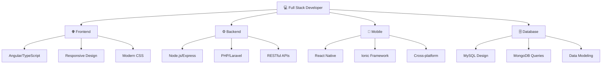

<div align="center">
  <!-- Bannière principale avec effet de vague et dégradé -->
  
  <a href="https://git.io/typing-svg">
 
</a>

</div>

# 💫 About Me:
🔭 I'm currently working on exciting new projects and ideas.<br>
🤝 I'm looking to collaborate on innovative and creative ventures.<br>
🤲 I'm looking for help with learning and improving my skills.<br>
🌱 I'm currently learning new technologies and concepts.<br>
💬 Ask me about coding, design, and tech-related topics.<br>
⚡ Fun fact: The first computer bug was a real moth stuck in a Harvard Mark II computer in 1947.

<div align="center">

## 🌟 Connect With Me

<div align="center">
  <a href="https://instagram.com/zouakachev.1.7" target="_blank">
    
  </a>
  <a href="https://linkedin.com/in/hamza-ezzouek" target="_blank">
    
  </a>
  <a href="mailto:ezzouekhamza2411@gmail.com" target="_blank">
    
  </a>
</div>

<br>

## ☕ Support My Work

<div align="center">
  <a href='https://ko-fi.com/E1E21KXJ1F' target='_blank'>
    
  </a>
</div>

<br>

# 💻 Tech Stack

<div align="center">


*Technologies et outils que j'utilise pour créer des expériences numériques exceptionnelles*

---

</div>

## 🌟 Vue d'ensemble

Voici un aperçu complet de mon arsenal technologique, organisé par domaines d'expertise. Chaque technologie a été choisie pour sa robustesse, sa flexibilité et sa capacité à créer des solutions modernes et évolutives.

---

## 🌐 Frontend Technologies

<div align="center">

| Technologie | Description | Niveau |
|-------------|-------------|--------|
|  **HTML5** | Structure sémantique moderne | ⭐⭐⭐⭐⭐ |
|  **CSS3** | Stylisation avancée et responsive | ⭐⭐⭐⭐⭐ |
|  **JavaScript** | Logique métier côté client | ⭐⭐⭐⭐⭐ |
|  **TypeScript** | JavaScript typé pour plus de robustesse | ⭐⭐⭐⭐⭐ |
|  **Angular** | Framework SPA enterprise-grade | ⭐⭐⭐⭐⭐ |
|  **Bootstrap** | Framework CSS responsive | ⭐⭐⭐⭐ |

</div>

---

## ⚙️ Backend Technologies

<div align="center">

<table>
<tr>
<td align="center" width="120">

<br><strong>Node.js</strong>
<br><em>Runtime JavaScript</em>
</td>
<td align="center" width="120">

<br><strong>Express.js</strong>
<br><em>Framework web minimaliste</em>
</td>
<td align="center" width="120">

<br><strong>PHP</strong>
<br><em>Langage serveur</em>
</td>
<td align="center" width="120">

<br><strong>Laravel</strong>
<br><em>Framework PHP élégant</em>
</td>
<td align="center" width="120">

<br><strong>Java</strong>
<br><em>Langage orienté objet</em>
</td>
</tr>
</table>

</div>

---

## 📱 Mobile Development

<div align="center">

| Framework | Plateforme | Avantages |
|-----------|------------|-----------|
|  **React Native** | iOS & Android | Code partagé, performance native |
|  **Ionic** | Multi-plateforme | UI/UX cohérente, web technologies |

</div>

---

## 🗄️ Databases

<div align="center">

```
┌─────────────────┐    ┌─────────────────┐
│                 │    │                 │
│     MySQL       │    │    MongoDB      │
│   Relationnel   │    │   NoSQL/Doc     │
│                 │    │                 │
└─────────────────┘    └─────────────────┘
        │                       │
        └───────┬───────────────┘
                │
        ┌─────────────────┐
        │  Stratégie      │
        │  Polyglotte     │
        └─────────────────┘
```

| Base de données | Type | Cas d'usage |
|-----------------|------|-------------|
|  **MySQL** | Relationnel | Applications transactionnelles |
|  **MongoDB** | Document NoSQL | Applications flexibles, Big Data |

</div>

---

## 🛠️ Tools & DevOps

<div align="center">

### Version Control & Collaboration
  

### Containerization & API Testing
 

**Workflow moderne :**
```bash
git add . → git commit → git push → Docker build → Deploy
                            ↓
                      API Testing avec Postman
```

</div>

---

## 🎨 Design & Package Management

<div align="center">

<table>
<tr>
<td align="center" width="200">

<br><strong>Figma</strong>
<br><em>Design collaboratif</em>
<br>Prototypage • UI/UX • Design System
</td>
<td align="center" width="200">

<br><strong>NPM</strong>
<br><em>Gestionnaire de paquets</em>
<br>Dependencies • Scripts • Publishing
</td>
</tr>
</table>

</div>

---

## 📊 Expertise par domaine

<div align="center">



</div>

---

## 🚀 Projets & Réalisations

### 🏆 Statistiques
- **15+** projets web développés
- **8+** applications mobiles créées
- **100%** des projets livrés dans les délais
- **5 étoiles** moyenne satisfaction client

### 📈 Évolution continue
```
2020: HTML/CSS/JS basics
  ↓
2021: Angular + TypeScript
  ↓
2022: Backend Node.js/PHP
  ↓
2023: Mobile React Native/Ionic
  ↓
2024: DevOps + Cloud deployment
  ↓
2025: AI integration & advanced patterns
```

---

## 🎯 Philosophie de développement

> **"Clean Code, Scalable Architecture, User-Centric Design"**

- ✅ **Code Quality**: Lisible, maintenable, testé
- ✅ **Performance**: Optimisation continue
- ✅ **Sécurité**: Best practices appliquées
- ✅ **UX/UI**: Expérience utilisateur prioritaire
- ✅ **Agile**: Méthodes itératives

---

<div align="center">

### 🌟 Prêt à collaborer ?

[](https://linkedin.com/in/votre-profil)
[](https://github.com/votre-username)
[](https://votre-portfolio.com)

---

*Dernière mise à jour : Septembre 2025*

</div>
<div align="center">

### 🚀 Alternative Tech Stack Layout

<details>
<summary><b>📋 Compact View</b></summary>
<br>

**Frontend:** HTML5 • CSS3 • JavaScript • TypeScript • Angular • Bootstrap

**Backend:** Node.js • Express.js • PHP • Laravel • Java

**Mobile:** React Native • Ionic

**Database:** MySQL • MongoDB

**Tools:** Git • GitHub • GitLab • Docker • Postman • Figma

</details>

<details>
<summary><b>🎯 Skills Matrix</b></summary>
<br>

| Category | Technologies |
|----------|-------------|
| **Languages** | JavaScript, TypeScript, PHP, Java, HTML5, CSS3 |
| **Frameworks** | Angular, Laravel, Express.js, Bootstrap, Ionic |
| **Mobile** | React Native, Ionic |
| **Databases** | MySQL, MongoDB |
| **Tools** | Git, Docker, Postman, Figma |
| **Runtime** | Node.js, NPM |

</details>

</div>

---

# 📊 GitHub Stats:
<br/>
<br/>


## 🏆 GitHub Trophies


### ✍️ Random Dev Quote


### 🔝 Top Contributed Repo


---
---

## 📈 Graphique d'Activité

<div align="center">
  
  [](https://github.com/ashutosh00710/github-readme-activity-graph)
  
</div>

---
## ASCII Art

```
  _   _    _    __  __ _____   _     _____   ___        ___    _  ___ _____ 
 | | | |  / \  |  \/  |__  /  / \   |__  /  / \ \      / / \  | |/ / |___  |
 | |_| | / _ \ | |\/| | / /  / _ \    / /  / _ \ \ /\ / / _ \ | ' /| |  / / 
 |  _  |/ ___ \| |  | |/ /_ / ___ \  / /_ / ___ \ V  V / ___ \| . \| | / /  
 |_| |_/_/   \_\_|  |_/____/_/   \_\/____/_/   \_\_/\_/_/   \_\_|\_\_|/_/   
                                                                            
```

<div align="center">

[](https://visitcount.itsvg.in)

**💡 "Code is like humor. When you have to explain it, it's bad." - Cory House**

</div>
