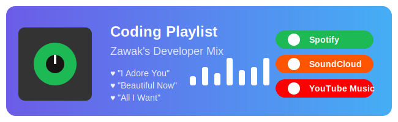

  <!-- Bannière personnalisée pour la programmation -->
  

<!-- Bannière animée avec des éléments de code -->

  

  

  
  
  
    

 
<!-- Profile Views Counter -->

  

 
 À propos de moi

javascriptconst zawak = {
  location: "Morocco 🇲🇦",
  role: "Software Engineering Student 👨‍💻",
  passions: ["Frontend Development", "UI/UX Design", "Open Source"],
  currentlyLearning: ["Java", "React Native"],
  workingOn: "Building innovative web experiences ✨",
  funFact: "Pourquoi les développeurs préfèrent le dark mode? " +
           "Parce que les bugs sont comme les cafards - " +
           "ils se cachent dans l'obscurité! 🪲"
};
 

<h2>🛠️ Tech Stack & Skills</h2>

<!-- Tech Stack Header with Animation -->

  

<!-- Main Tech Categories -->
<table border="0" align="center">
<tr>
  <td valign="top" width="33%">
  <!-- FRONTEND SECTION -->
  

    <h3>
      
    </h3>
    

      
      
      
      
      
      
    

  

  </td>
  <td valign="top" width="33%">
  <!-- BACKEND SECTION -->
  

    <h3>
      
    </h3>
    

      
      
      
      
    

  

  </td>
  <td valign="top" width="33%">
  <!-- DATABASE SECTION -->  
  

    <h3>
      
    </h3>
    

      
      
    

  

  </td>
</tr>
</table>
<!-- TOOLS SECTION -->

  <h3>
    
  </h3>
  

    
    
    
    
    
  

<!-- CURRENTLY LEARNING -->

  <h3>
    
  </h3>
  

    
    
  

<!-- Cool tech stack visualization -->

  

<!-- Quote about skills -->

  <blockquote>
    

      "La polyvalence technologique est la plus grande force d'un développeur moderne"
    

  </blockquote>

<h2>📊 GitHub Stats & Activité</h2>

  

  
  

 

  

 

  

<h2>🌟 Projets en cours</h2>

  
  
  

 

🔭 Développement de plusieurs projets web innovants avec React et Node.js
🌱 Apprentissage de React native pour le développement d'applications mobiles cross-platform
👯 Ouvert aux collaborations sur des projets open source et des défis techniques
🚀 Contribution à des projets open source pour la communauté

 
<!-- Contribution Snake Animation -->

  

 

  
  <h3>"Le code, c'est comme l'humour. Quand on doit l'expliquer, c'est mauvais." – Cory House</h3>

 
<!-- Music & Coding Section -->

  <h3>🎵 Coding Music Vibes 🎧</h3>
  
  <table>
    <tr>
      <td align="center">
        
      </td>
      <td align="center">
        
      </td>
      <td align="center">
        
      </td>
    </tr>
  </table>
  <blockquote>
    "La musique est pour l'âme ce que le code est pour l'ordinateur - un langage qui transcende les barrières"
  </blockquote>

 

  

